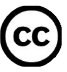

# 1. 背景（校对2）

这篇文档会从技术和协议层面介绍http2。文档起源于2014年4月我在斯德哥尔摩做了一次相关的演讲，在那之后我对演讲内容的细节进行了一些解释和补充，从而写出了这篇文档。

正式版http2规格标准叫做RFC 7540，发布于2015年5月15日：http://www.rfc-editor.org/rfc/rfc7540.txt

如果你有在这篇文章中发现任何我的失误造成的错误或疏漏，请帮我指正。我会在后续版本中修改。

为了让阅读体验更流畅，在这篇文章中我会使用“http2”来指代这一新协议，但请记住该协议的正式名字是HTTP/2。

*这篇文档版本为1.12，发布于2015年5月21日。*

**1.1. 关于作者**

我的名字叫做Daniel Stenberg，在Mozilla工作。在过去20年，我一直致力于开源事业，参与了多个网络方面的项目。可能我最广为人知的身份是curl和libcurl的首席开发者。同时，我也参与了IETF HTTPbis工作组多年，工作在HTTP 1.1和http2标准化的一线.

  * Email: daniel@haxx.se
  * Twitter: [@bagder](https://twitter.com/bagder)
  * Web: [daniel.haxx.se](http://daniel.haxx.se/)
  * Blog: [daniel.haxx.se/blog](http://daniel.haxx.se/blog/)

**1.2. 帮助我！**

如果你在该文档里面发现任何错误、疏漏，请发送给我一份相关段落更改后的版本，我会进行修正并且注明所有对文档有贡献的人！希望这份文档能越来越好。

这篇文档可以在[http://daniel.haxx.se/http2](http://daniel.haxx.se/http2)下载。

**1.3. 许可证**

这篇文档基于Createive Commons Attribution 4.0发布： [http://creativecommons.org/licenses/by/4.0/](http://creativecommons.org/licenses/by/4.0/)

**1.4. 文档历史**

该文档的第一版发布于2014年4月25日。下面是最近主要改动的更新历史。

**Version 1.12:**
* 1.1: HTTP/2 is now in an official RFC
* 6.5.1: link to the HPACK RFC
* 9.1: mention the Firefox 36+ config switch for http2
* 12.1: Added section about QUIC

**Version 1.11:**
* Lots of language improvements mostly pointed out by friendly contributors
* 8.3.1: mention nginx and Apache httpd specific acitivities

**Version 1.10:**
* 1: the protocol has been “okayed”
* 4.1: refreshed the wording since 2014 is last year
* front: added image and call it “http2 explained” there, fied link
* 1.4: added document history section
* many spelling and grammar mistakes corrected
* 14: added thanks to bug reporters
* 2.4: (better) labels for the HTTP growth graph
* 6.3: corrected the wagon order in the multiplexed train
* 6.5.1: HPACK draft-12

**Version 1.9: February 11, 2015**
* Updated to HTTP/2 draft-17 and HPACK draft-11
* Added section "10. http2 in Chromium" (== one page longer now)
* Lots of spell fies
* At 30 implementations now
* 8.5: added some current usage numbers
* 8.3: mention internet explorer too
* 8.3.1 "missing implementations" added
* 8.4.3: mention that TLS also increases success rate

**Version 1.8: January 15th, 2015**
* Compressed the images better, leading to a much smaller PDF
* Updated to draft-16 and hpack-10
* Replaced several images
* Linkifid many URLs
* Added a few questions in 8.4
* Mentions IETF Last Call

<!-- Review备注：这一章翻译已经没有明显问题。 -->
