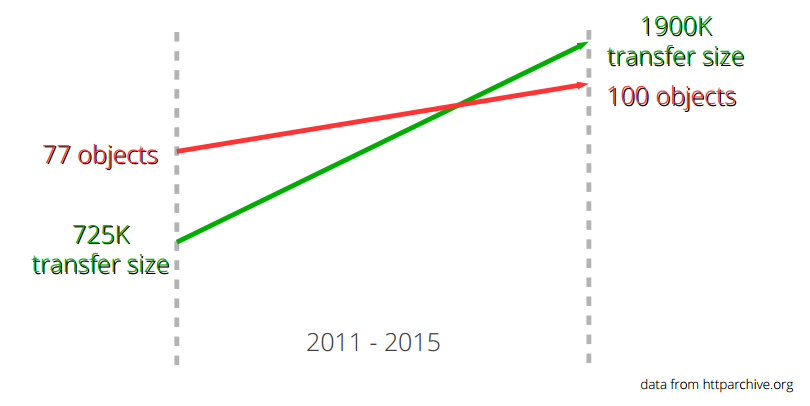
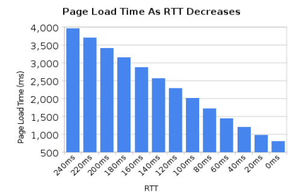

# 2. HTTP的现状（校对2）

互联网上几乎所有内容都采用HTTP 1.1作为通信协议。人们在该协议上投入了大量精力，基于它的基础架构也因此日臻完善。<!--前面这句话需要review一下-->正因如此，在HTTP协议之上构建新的方案会比从底层建立新的协议容易得多。

**2.1. HTTP 1.1过于庞大**

HTTP刚诞生的时候只被当作是一个相对简单直观的协议，但时间证明这种初始设计并不如意。定义HTTP 1.0规范的RFC 1945共有60页，发布于1996年。仅仅3年之后，定义HTTP 1.1规范的RFC 2616却一下增长到了176页。然而，当我们在IETF在进行该规范更新工作时，它被拆分成了总页数更多的六个文档（这就是RFC 7230及其文件族的诞生）。不管怎么样，HTTP 1.1包含了太多细节和可选的部分，这让它变得过于庞大。

**2.2. 过多的可选项**

HTTP 1.1不仅包含了非常多的细枝末节，还为将来的扩展预留的很多选项。这种事无巨细的风格导致在现在的软件生态中，几乎没有任何实现真正实现了协议中提及的所有细节，甚至要弄清楚“所有细节”到底包括哪些细节都非常困难。正因为如此，很多最初不常用的功能在后来的实现中很少会被支持，而有些最初实现了的功能，却又很少被使用。

随着时间推移，这些当初看似被边缘化的功能逐渐被用上，客户端和服务器的互用性（interoperability）问题就被暴露了出来。HTTP管线化（HTTP Pipelining）就是一个非常好的例子。

**2.3. 未能被充分利用的TCP**
  
HTTP 1.1很难榨干TCP协议所能提供的所有性能。HTTP客户端和浏览器必须要另辟蹊径的去找到新的解决方案来降低页面载入时间。

与此同时，人们也尝试去用新的协议来替代TCP，但结果证明这也非常困难。无奈之下，我们只能尝试同时改进TCP协议本身和基于TCP的上层协议。

简言之，我们也能通过更好的利用TCP来减少传输过程中的暂停，并充分挖掘利用那些本可以用于发送/接受更多数据的时间。下面几段将会着重讨论这些问题。<!--这里的shortcomings该怎么翻译？ -->
  
**2.4. 传输大小和资源数量**

如果仔细观察打开那些最流行的网站首页所需要下载的资源的话，会发现一个非常明显的趋势。  近年来加载网站首页需要的下载的数据量在逐渐增加，并已经超过了1.9MB。但在这里我们更需要关注的是：显示每个页面所需下载的平均资源数也超过了100个。<!--这里是按照1.11版本翻译的 -->

正如下图所示，这种趋势已经持续了很长一段时间，并却没有减缓的迹象。该图表中绿色直线展示了传输数据大小的增长，红色直线展示了平均请求资源数量的增长。

**2.5 恼人的延迟**

HTTP 1.1对网络延迟非常敏感。部分原因是HTTP Pipelining还有很多问题，所以对大部分用户来说是默认关闭的。

虽然近几年来网络带宽增长非常快，但是与此相对的是，我们并没有看到网络延迟有对应程度的降低。在高延迟的网络上（比如移动设备），即使拥有高连接速率，也很难获得优质快速的网络体验。

另外一个需要低延迟的场景是某些视频服务，如视频会议、游戏和一些类似无法预生成待发送数据流的服务。

**2.6 线头阻塞（Head of line blocking）**<!-- 整个这一节感觉解释的不够清楚，需要review-->
  
HTTP Pipelining是一种利用等待上一请求响应的间隙，提前发送下一请求的技术。如同你在超市收银台或者银行柜台排队时，你并不知道前面的顾客是干脆利索的还是会跟收银员/柜员磨蹭到世界末日，这就是所谓的线头阻塞（Head of line blocking）。

当然，你可以在选择队伍时候就做好功课，去排一个你认为最快的队伍，或者甚至另起一个新的队伍。但不管怎么样，你总归得先选择一个队伍，且一旦选定之后，就不能换队伍重排。

但当然没有完美的方案，另起一个新队伍会导致性能和资源的浪费。所以当队伍很大的时候，这种方法并不能扩展。<!--这段话我都没看懂-->

即使在2015年的今天，大部分桌面浏览器也默认关闭了HTTP pipelining功能。

关于这个主题的细节，可以去阅读Firefox bugzilla的第[264354](https://bugzilla.mozilla.org/show_bug.cgi?id=264354)条。

<!-- Review备注：2.6需要深度review，其余地方没有太大问题。 -->
