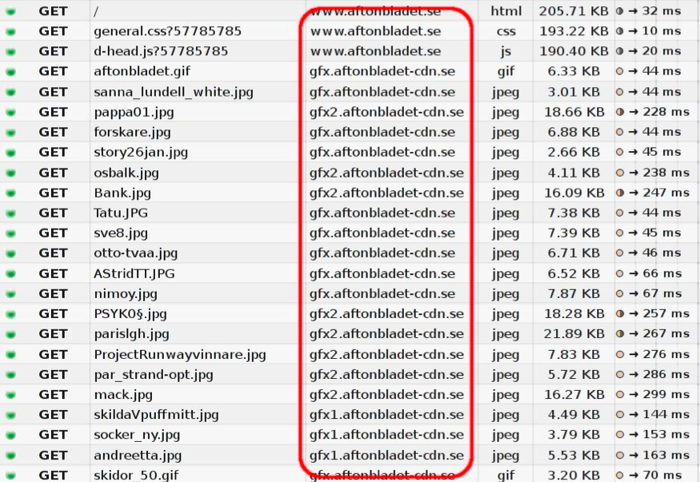

# 3. 那些年，克服延迟之道（未校对）

再困难的问题也有解决的方案，但这些方案却良莠不齐。

**3.1. Spriting**

Spriting是一种将很多过小的图片合并成一张大图，再用Javascritp或者CSS“切割”出来的技术。

网站可以用该技术来提速：在HTTP 1.1里，下载一张大图比下载100张小图快得多。

当然这种方案的缺点就是当某些页面只需要显示其中一两张小图时，整张大图都会被从cache里取出。

**3.2. 内联**

内联是另外一种防止发送很多小图请求的技巧，它是通过在CSS文件里面的URLs里嵌入图片原始数据。这种方案有跟Spriting类似的优缺点。

    .icon1 {
        background: url(data:image/png;base64,<data>) no-repeat;
	}
    .icon2 {
        background: url(data:image/png;base64,<data>) no-repeat;
	}

**3.3. 拼接**

一个大的网站往往会包含非常多的Javascript文件，一些前端工具能帮助开发人员合并这些文件，从而让浏览器能通过一个请求下载完所有Javascrpt以节省开销。但跟上两种技巧类似的，如果某个网页只需要其中一小部分Javascript，它也必须下载完整的备份。同时一个小小的改动也会造成大量数据的重新载入。

这种方式给开发者造成了极大的不便。

**3.4 Sharding**

最后一个我要说的技术常被站长们用来优化浏览器体验，叫做“Sharding”。顾名思义，Sharding就是把你的服务分散在尽可能多的主机上。这种方案乍一听比较疯狂，但是实际上理由却非常简单！

最初的HTTP 1.1规范提到一个客户端最多只能对同一主机建立两个TCP连接。因此，为了不和规范冲突，一些网站聪明地使用了新的主机名。这样的话，用户就能和网站建立更多的连接，从而降低载入时间。

后来，两个连接的限制被规范取消了，现在的客户端可以轻松地和每个主机建立6-8个连接，但限制依然存在，被服务端用以缓解连接数过多造成的压力。随着资源个数的提升（上面章节的图例），网站需要更多的连接来保证HTTP协议的效率，提升载入速度。在如今的网站上，使用50甚至100个连接来打开一个页面的例子并不罕见。httparchive.org的最新记录显示，在Top 30万个URLs里面平均使用38个TCP连接来显示页面。并且这个数字仍然在缓慢的增长。

另外一个将图片或者其他资源分发到不同主机的理由是可以不使用cookies，如今cookies的大小可能已经非常可观了。无cookies的图片服务器意味着更小的HTTP请求和更好的性能。

下面的图片展示了访问一个瑞典著名网站的时候的数据包，请注意这些请求是如何被分发到不同主机的。

